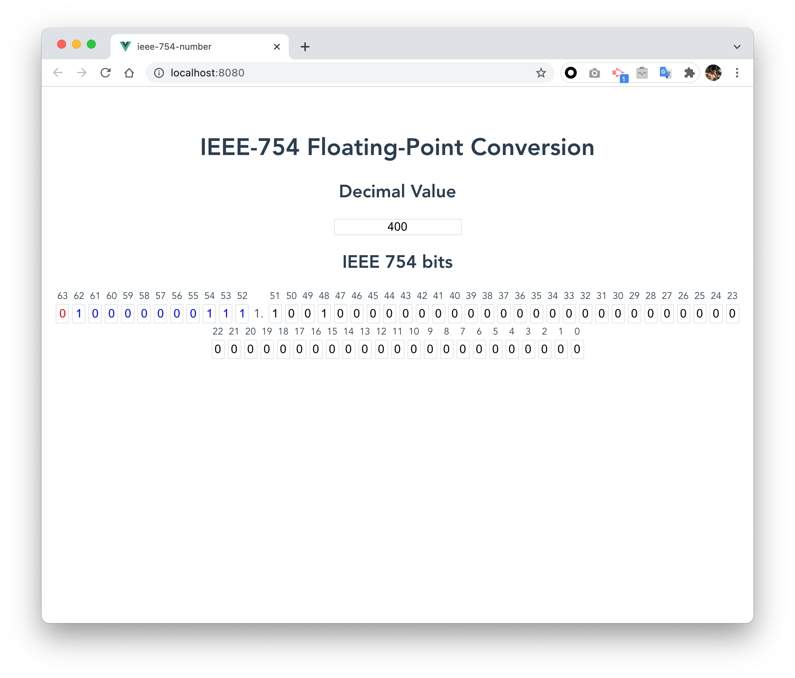

# ieee-754-number

## Example


See result in [CodeSandBox](https://codesandbox.io/s/festive-goldberg-tuvvy?file=/src/components/IEEENumber.vue)

## Project setup
```
yarn install
```

### Compiles and hot-reloads for development
```
yarn serve
```

### Compiles and minifies for production
```
yarn build
```

### Lints and fixes files
```
yarn lint
```

### Customize configuration
See [Configuration Reference](https://cli.vuejs.org/config/).
